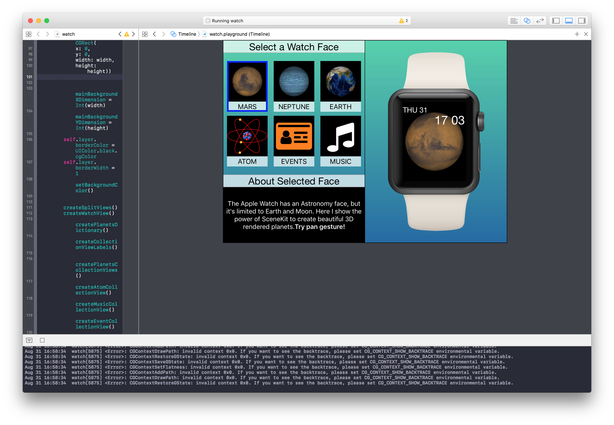
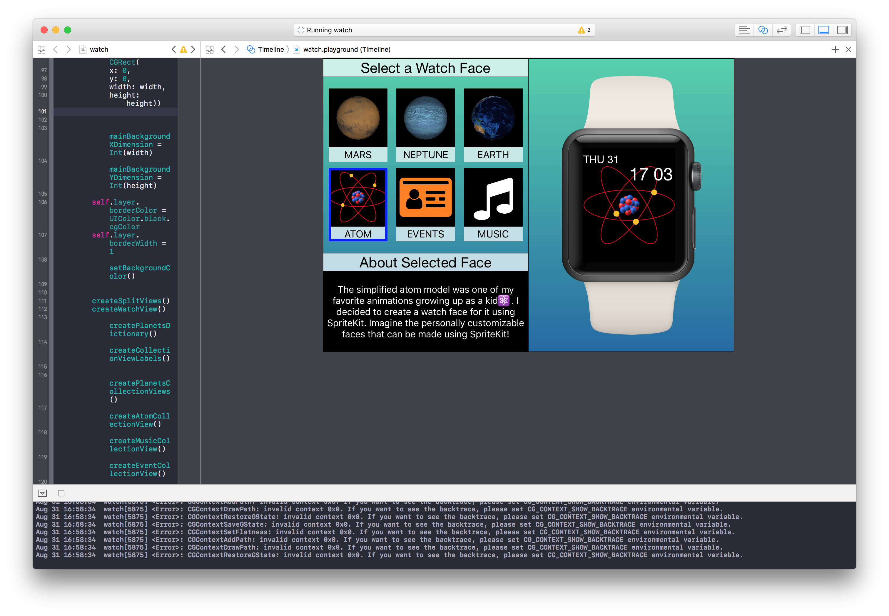
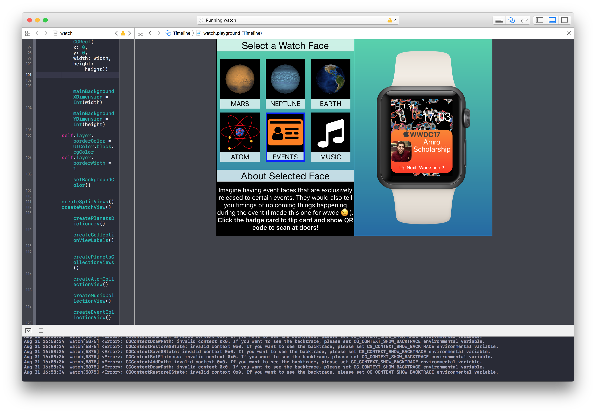
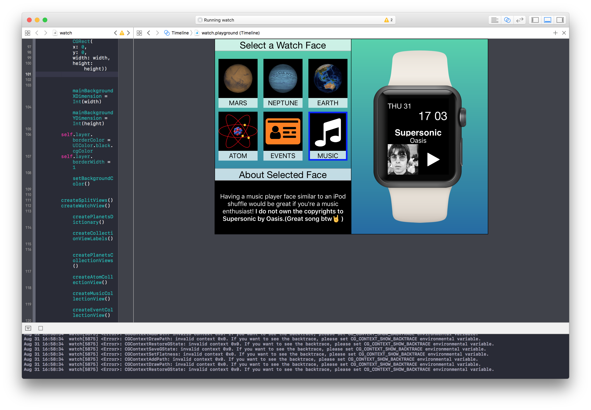

# Watches
Swift Playgrounds is a powerful tool that allows rapid, interactive prototyping of many iOS and macOS technologies. This project shows an imaginative extension of what swift playgrounds can offer for the Apple Watch in the future, by demoing some of my custom made watch faces. 

